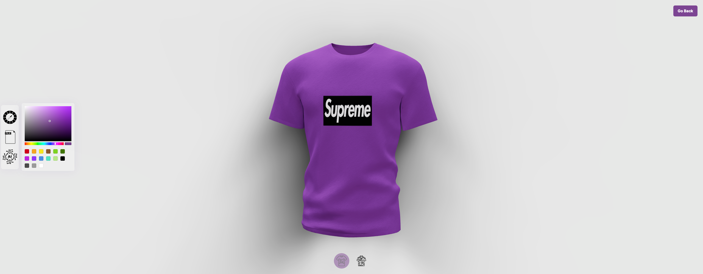

# 3d AI Shirt Customization

## Description
Discover the ultimate shirt customization experience with my innovative 3D rendering tool. This unique application, meticulously crafted with the power of Three.js and React, enables you to create a shirt design that's distinctively you. Utilizing advanced artificial intelligence and Node.js for the backend operations, I ensure a seamless and interactive customization process. <strong>Unleash your imagination</strong> and define your own style with precision and creativity, all in real-time 3D. Step into the future of fashion design with my groundbreaking 3D shirt rendering application.

## Deployment 
You can view the app with its deployment link [here](https://james3dshirt.com/)

## Screenshots

### Color Changer
Here is a screenshot of the capabilities! :camera::camera::camera:

### File Upload
You can upload your own files i uploaded a file for one of my upcoming music releases 

### Ai Generation
This is the best part!! Using OpenAIs text to Image Beta for DALL.E you can type a prompt and a logo is generated for you 

## Contact 
Thank You for checking out my 3d render application!!!
if you'd like to contact me you can here..
 
[Email](mailto:jamesthomaspatmore7@gmail.com)
 
[LinkedIn](https://www.linkedin.com/in/james-patmore-64a6a1166/)
 
[Portfolio](https://jamestpatmore.com)